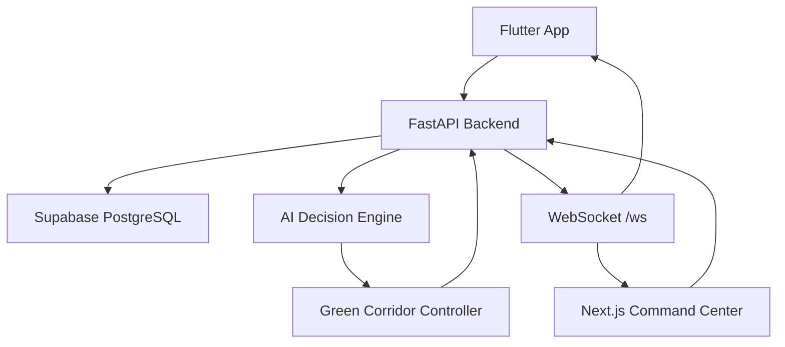

# Architecture

```mermaid
flowchart TD
  A["Flutter App"] --> B["FastAPI Backend"]
  C["Next.js Command Center"] --> B
  B --> D["Supabase PostgreSQL"]
  B --> E["AI Decision Engine"]
  E --> F["Green Corridor Controller"]
  F --> B
  B --> G["WebSocket /ws"]
  G --> A
  G --> C
```

The backend owns the realtime state transition: ambulance activation updates signals, event logs, alerts, and analytics, then broadcasts updates to Flutter and web clients.
