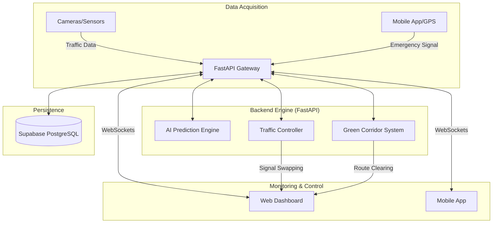

# System Architecture - GreenFlow AI

GreenFlow AI utilizes a distributed event-driven architecture to ensure sub-second response times for emergency vehicle prioritization.

## High-Level Flow

## Component Details

### 1. AI Prediction Engine
Uses historical traffic patterns and real-time load data to predict congestion events. It uses a weighted moving average and threshold-based classification to suggest signal timing adjustments.

### 2. Green Corridor System
When an emergency vehicle is detected or manually triggered, this system:
1. Calculates the optimal route to the destination.
2. Identifies all traffic signals along that route.
3. Issues `PRIORITY` commands to the Traffic Controller.
4. Updates the Web Dashboard and Mobile App via WebSockets.

### 3. Traffic Controller
Manages the state of the digital twins of physical traffic lights. It ensures that signal transitions (Red -> Green) happen safely and maintains a log of all state changes for analytics.

### 4. Real-time Synchronization
Powered by WebSockets, allowing the Command Center to reflect signal changes and vehicle positions with <100ms latency.
